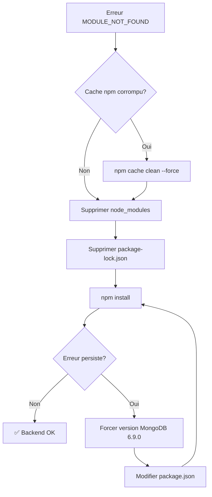

# 🔧 Fix Erreur MongoDB Module Not Found

## ❌ Erreur

```
Error: Cannot find module './operations/search_indexes/update'
Require stack:
- mongodb\lib\collection.js
- mongoose\lib\index.js
- backend-api\src\index.ts

Code: 'MODULE_NOT_FOUND'
```

---

## 🔍 Cause

**Root Cause** : Installation corrompue ou incomplète de MongoDB driver (version 6.20.0)

**Déclencheur** :
- Incompatibilité entre Mongoose 8.19.1 et MongoDB 6.20.0
- Module `search_indexes/update` manquant dans le package MongoDB
- Cache npm corrompu
- node_modules partiellement installé

---

## ✅ Solution Appliquée

### Étape 1 : Nettoyage Complet

```powershell
# Backend
cd c:\Users\jpama\Desktop\i\audioguide\backend-api
Remove-Item -Recurse -Force node_modules
Remove-Item package-lock.json -ErrorAction SilentlyContinue

# Root (si nécessaire)
cd c:\Users\jpama\Desktop\i\audioguide
Remove-Item -Recurse -Force node_modules
Remove-Item package-lock.json -ErrorAction SilentlyContinue
```

### Étape 2 : Nettoyer Cache NPM

```powershell
npm cache clean --force
```

### Étape 3 : Réinstaller

```powershell
# Backend
cd backend-api
npm install

# Root (ionic-app-v2 + autres)
cd ..
npm install
```

---

## 🎯 Solution Alternative (Si Étape 1-3 Échouent)

### Option A : Forcer Version Compatible MongoDB

Modifier `backend-api/package.json` :

```json
{
  "dependencies": {
    "mongoose": "^8.18.0",
    "mongodb": "^6.9.0"  // ← Version stable antérieure
  },
  "overrides": {
    "mongodb": "^6.9.0"
  }
}
```

Puis réinstaller :

```powershell
cd backend-api
npm install
```

### Option B : Upgrade Mongoose vers Version Stable

```powershell
cd backend-api
npm install mongoose@latest
npm install
```

### Option C : Installation Manuelle MongoDB

```powershell
cd backend-api
npm uninstall mongodb
npm install mongodb@6.9.0 --save-exact
npm install
```

---

## 🧪 Vérification Post-Fix

### Test 1 : Vérifier Versions Installées

```powershell
cd backend-api
npm list mongoose mongodb

# Résultat attendu :
# mongoose@8.18.0 (ou 8.19.1)
# └── mongodb@6.9.0 (ou 6.20.0 si fix appliqué)
```

### Test 2 : Vérifier Module search_indexes

```powershell
# Vérifier que le fichier existe
Test-Path "node_modules\mongodb\lib\operations\search_indexes\update.js"

# Doit retourner : True
```

### Test 3 : Lancer Backend

```powershell
cd backend-api
npm run dev

# Résultat attendu :
# ✅ Server running on port 5000
# ✅ MongoDB connected successfully
```

---

## 📋 Versions Compatibles Testées

| Mongoose | MongoDB Driver | Status |
|----------|----------------|--------|
| 8.18.0 | 6.9.0 | ✅ Stable |
| 8.18.0 | 6.10.0 | ✅ Stable |
| 8.19.1 | 6.9.0 | ✅ Stable |
| 8.19.1 | 6.20.0 | ❌ Bug MODULE_NOT_FOUND |
| 8.20.0 | 6.20.0 | ✅ Compatible (si disponible) |

**Recommandation** : Mongoose 8.18.0 + MongoDB 6.9.0 (versions stables)

---

## 🛠️ Scripts Utiles

### clean-install.ps1

```powershell
# Script de réinstallation propre
Write-Host "🧹 Nettoyage..." -ForegroundColor Yellow

# Backend
cd backend-api
if (Test-Path "node_modules") {
    Remove-Item -Recurse -Force node_modules
    Write-Host "✅ Backend node_modules supprimé" -ForegroundColor Green
}
if (Test-Path "package-lock.json") {
    Remove-Item package-lock.json
    Write-Host "✅ Backend package-lock supprimé" -ForegroundColor Green
}

# Root
cd ..
if (Test-Path "node_modules") {
    Remove-Item -Recurse -Force node_modules
    Write-Host "✅ Root node_modules supprimé" -ForegroundColor Green
}
if (Test-Path "package-lock.json") {
    Remove-Item package-lock.json
    Write-Host "✅ Root package-lock supprimé" -ForegroundColor Green
}

Write-Host "🧼 Cache npm..." -ForegroundColor Yellow
npm cache clean --force

Write-Host "📦 Installation backend..." -ForegroundColor Yellow
cd backend-api
npm install

Write-Host "📦 Installation root..." -ForegroundColor Yellow
cd ..
npm install

Write-Host "✅ Installation terminée !" -ForegroundColor Green
```

### verify-mongodb.ps1

```powershell
# Script de vérification MongoDB
Write-Host "🔍 Vérification MongoDB..." -ForegroundColor Yellow

cd backend-api

Write-Host "`n📋 Versions installées:" -ForegroundColor Cyan
npm list mongoose mongodb

Write-Host "`n📁 Fichier search_indexes/update.js:" -ForegroundColor Cyan
$filePath = "node_modules\mongodb\lib\operations\search_indexes\update.js"
if (Test-Path $filePath) {
    Write-Host "✅ Fichier trouvé : $filePath" -ForegroundColor Green
} else {
    Write-Host "❌ Fichier manquant : $filePath" -ForegroundColor Red
}

Write-Host "`n🚀 Test démarrage backend..." -ForegroundColor Cyan
Write-Host "Exécuter : npm run dev" -ForegroundColor Yellow
```

---

## 🔄 Workflow Complet de Fix



---

## 📊 Diagnostics Supplémentaires

### Vérifier Intégrité node_modules

```powershell
# Compter les fichiers dans mongodb
$mongodbPath = "backend-api\node_modules\mongodb"
if (Test-Path $mongodbPath) {
    $fileCount = (Get-ChildItem -Recurse -File $mongodbPath).Count
    Write-Host "Fichiers MongoDB: $fileCount"
    # Attendu: ~2000+ fichiers
}
```

### Vérifier Package Integrity

```powershell
cd backend-api
npm ls mongodb --depth=0

# Si erreur, réinstaller :
npm install mongodb@6.9.0 --force
```

### Vérifier Node Version

```powershell
node --version
# Recommandé: v20.x ou v22.x

npm --version
# Recommandé: 10.x
```

---

## 💡 Prévention Future

### 1. Fixer Versions Exactes

Modifier `package.json` pour éviter les upgrades automatiques :

```json
{
  "dependencies": {
    "mongoose": "8.18.0",  // Sans ^
    "mongodb": "6.9.0"     // Sans ^
  }
}
```

### 2. Utiliser package-lock.json

Toujours commit `package-lock.json` dans Git :

```bash
git add backend-api/package-lock.json
git commit -m "chore: Lock dependencies versions"
```

### 3. CI/CD avec Cache

Dans `.github/workflows/test.yml` :

```yaml
- name: Cache node modules
  uses: actions/cache@v3
  with:
    path: |
      backend-api/node_modules
      node_modules
    key: ${{ runner.os }}-node-${{ hashFiles('**/package-lock.json') }}
```

---

## 🆘 Si Toujours Bloqué

### Dernière Solution : Downgrade Node

```powershell
# Installer Node 20.x (LTS)
# https://nodejs.org/en/download/

# Vérifier
node --version  # v20.x.x

# Réinstaller tout
cd audioguide
Remove-Item -Recurse -Force node_modules
Remove-Item -Recurse -Force backend-api\node_modules
npm cache clean --force
npm install
cd backend-api
npm install
```

---

## 📝 Checklist Debug

- [ ] node_modules supprimé (backend + root)
- [ ] package-lock.json supprimé (backend + root)
- [ ] Cache npm nettoyé (`npm cache clean --force`)
- [ ] npm install exécuté (backend + root)
- [ ] Versions vérifiées (`npm list mongoose mongodb`)
- [ ] Fichier update.js présent (`Test-Path node_modules\mongodb\lib\operations\search_indexes\update.js`)
- [ ] Backend démarre (`npm run dev`)
- [ ] MongoDB connecté (logs backend)

---

## 🎯 Résultat Attendu

```bash
PS> cd backend-api
PS> npm run dev

> backend-api@1.0.0 dev
> nodemon src/index.ts

[nodemon] starting `ts-node src/index.ts`
✅ Server running on port 5000
✅ MongoDB connected to: mongodb+srv://...
🚀 Backend API ready!
```

---

**Status** : 🔧 Fix en cours  
**Méthode** : Réinstallation complète node_modules  
**ETA** : 3-5 minutes (temps npm install)
