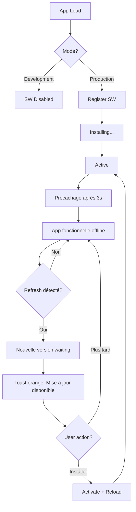

# 🔄 Service Worker - États et Comportements

## Vue d'ensemble

Le Service Worker de l'application passe par plusieurs états et affiche différents messages selon les situations.

## 📊 Les différents statuts du Service Worker

### 1. **État Initial (Désactivé en dev)**
```
ℹ️ Service Worker désactivé en développement
```
- **Quand**: Mode développement (`npm run dev`)
- **Pourquoi**: Éviter les conflits avec le hot reload de Vite
- **Action**: Aucune

### 2. **État d'enregistrement (Registration)**
```typescript
swStatus = {
  registered: false,
  active: false,
  waiting: false,
  installing: true,
  updateAvailable: false
}
```
- **Quand**: Premier chargement de l'app en production
- **Message**: Aucun toast (processus silencieux)
- **Durée**: ~1-2 secondes

### 3. **État actif (Active)**
```typescript
swStatus = {
  registered: true,
  active: true,
  waiting: false,
  installing: false,
  updateAvailable: false
}
```
- **Quand**: Service Worker installé et opérationnel
- **Message Toast**: `🚀 Mode offline activé !` (vert, 3 secondes)
- **Comportement**: 
  - Cache stratégique activé (API, images, tuiles OSM)
  - Mode offline fonctionnel
  - Précachage des ressources après 3 secondes

### 4. **État de précachage**
```
📦 Précachage des ressources essentielles...
```
- **Quand**: 3 secondes après activation, si online et pas de mise à jour en attente
- **Message Toast**: `✅ X attractions en cache` (vert, 3 secondes)
- **Ressources précachées**:
  - Images des attractions (covers + galeries)
  - Données JSON des attractions
  - Assets statiques (JS, CSS, fonts)

### 5. **État de mise à jour disponible (Waiting)**
```typescript
swStatus = {
  registered: true,
  active: true,
  waiting: true,
  installing: false,
  updateAvailable: true
}
```
- **Quand**: Nouveau build détecté lors d'un refresh
- **Message Toast**: `🔄 Mise à jour disponible ! Cliquez pour installer.` (orange, persistant)
- **Boutons**:
  - **Installer**: Active la nouvelle version → Reload automatique
  - **Plus tard**: Ferme le toast, l'ancienne version reste active

### 6. **État hors ligne (Offline)**
```
isOnline: false
```
- **Quand**: Perte de connexion réseau
- **Comportement**:
  - Service Worker sert les ressources depuis le cache
  - API responses servies depuis `api-cache` (max 5 min)
  - Images servies depuis `images-cache` (max 30 jours)
  - Tuiles OSM servies depuis `osm-tiles-cache` (max 60 jours)

## 🔧 Configuration actuelle

### Mode de mise à jour: `prompt`
```typescript
VitePWA({
  registerType: 'prompt', // Demande confirmation avant update
  // ...
})
```

**Options disponibles**:
- `autoUpdate`: Met à jour automatiquement (⚠️ ancien comportement = toast à chaque refresh)
- `prompt`: Demande confirmation à l'utilisateur (✅ recommandé)
- `skipWaiting`: Met à jour immédiatement sans attendre

### Stratégies de cache Workbox

#### 1. **API Backend - Network First**
```typescript
urlPattern: /^https:\/\/audio-guide-w8ww\.onrender\.com\/api\/.*/i
handler: 'NetworkFirst'
maxAgeSeconds: 5 * 60 // 5 minutes
```
- Essaye le réseau d'abord
- Fallback sur le cache si offline
- Cache expiré après 5 minutes

#### 2. **Images - Cache First**
```typescript
urlPattern: /\.(?:png|jpg|jpeg|svg|gif|webp)$/i
handler: 'CacheFirst'
maxAgeSeconds: 30 * 24 * 60 * 60 // 30 jours
```
- Sert depuis le cache immédiatement
- Met à jour le cache en arrière-plan
- Cache valide 30 jours

#### 3. **Tuiles OpenStreetMap - Cache First**
```typescript
urlPattern: /^https:\/\/[abc]\.tile\.openstreetmap\.org\/.*/i
handler: 'CacheFirst'
maxAgeSeconds: 60 * 24 * 60 * 60 // 60 jours
maxEntries: 500
```
- Cache agressif pour les tuiles de carte
- Max 500 tuiles en cache
- Expire après 60 jours

## 🐛 Problème résolu: Toast orange à chaque ouverture

### Cause
```typescript
registerType: 'autoUpdate' // ❌ Ancien comportement
```
- Vérification automatique à chaque chargement
- Détection de "nouvelle version" même sans changement réel
- Toast affiché à répétition

### Solution
```typescript
registerType: 'prompt' // ✅ Nouveau comportement
```
- Attend qu'une vraie mise à jour soit détectée
- Affiche le toast UNE SEULE FOIS par mise à jour
- Flag `updateNotified` empêche les répétitions

### Code anti-répétition
```typescript
const [updateNotified, setUpdateNotified] = useState(false);

useEffect(() => {
  if (updateAvailable && !updateNotified) {
    setUpdateNotified(true); // ← Empêche les notifications répétées
    setToastMessage('🔄 Mise à jour disponible !');
    setShowToast(true);
  }
}, [updateAvailable, updateNotified]);
```

## 📱 Cycle de vie complet



## 🎯 Bonnes pratiques

### ✅ À faire
- Toujours tester les mises à jour en mode production (`npm run build`)
- Vérifier le comportement offline avec DevTools > Application > Service Workers
- Clear le cache SW lors de changements majeurs (DevTools > Application > Clear storage)
- Utiliser `registerType: 'prompt'` pour les apps critiques

### ❌ À éviter
- Ne jamais utiliser `autoUpdate` en production (trop agressif)
- Ne pas oublier de gérer l'état `waiting` (SW en attente)
- Ne pas cacher plus de 500 MB (limite navigateur)
- Ne pas cacher les données sensibles (tokens, passwords)

## 🔍 Debug

### Console logs utiles
```javascript
// Voir l'état du SW
serviceWorkerService.getStatus()

// Voir le rapport de cache
await serviceWorkerService.getCacheReport()

// Forcer l'activation d'une mise à jour
await serviceWorkerService.activateUpdate()

// Vider tous les caches
await serviceWorkerService.clearAllCaches()
```

### Chrome DevTools
1. **Application** > **Service Workers**
   - Voir l'état (activated, waiting, installing)
   - Unregister / Update / Skip waiting

2. **Application** > **Cache Storage**
   - Voir les caches: `workbox-precache`, `api-cache`, `images-cache`, etc.
   - Inspecter les entrées cachées

3. **Network**
   - Cocher "Offline" pour tester le mode hors ligne
   - Filtrer par "ServiceWorker" pour voir les requêtes servies depuis le cache

## 📚 Ressources

- [Workbox Documentation](https://developers.google.com/web/tools/workbox)
- [Service Worker Lifecycle](https://web.dev/service-worker-lifecycle/)
- [vite-plugin-pwa](https://vite-pwa-org.netlify.app/)
